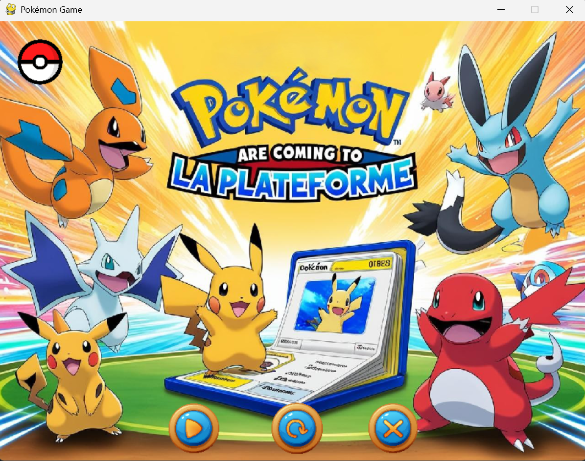
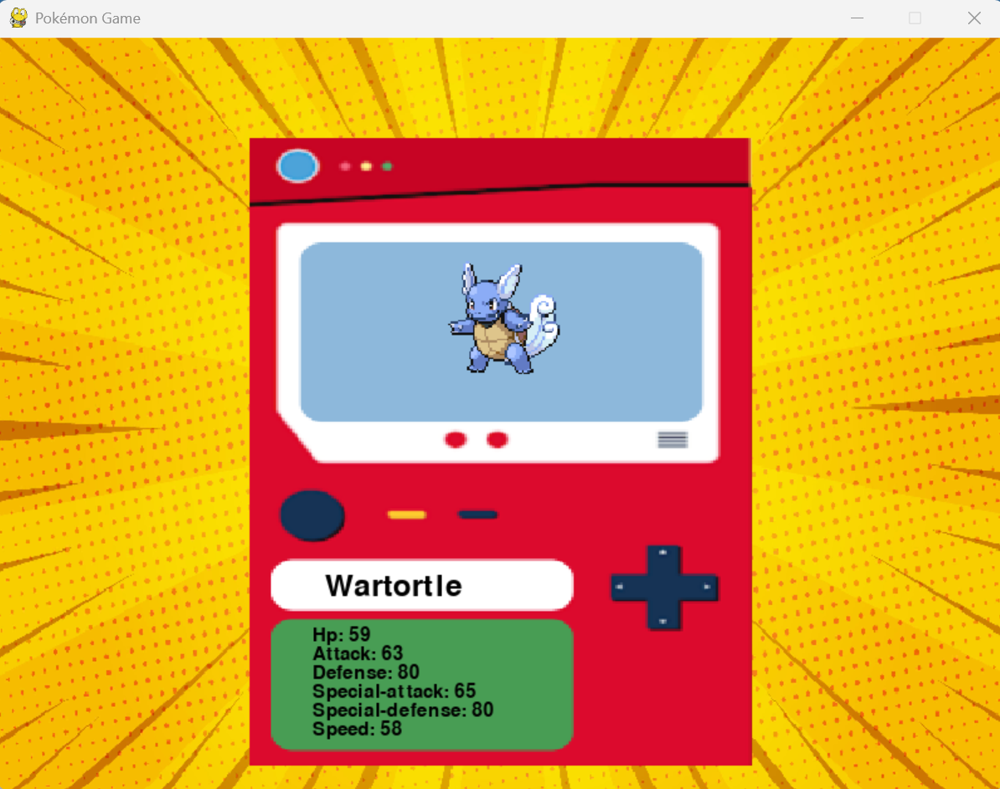
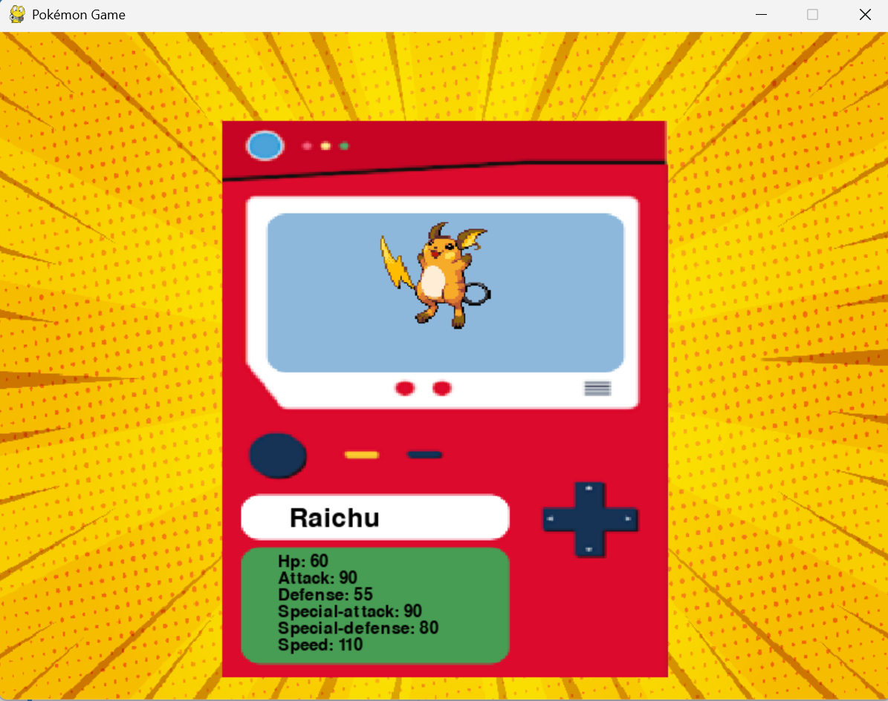
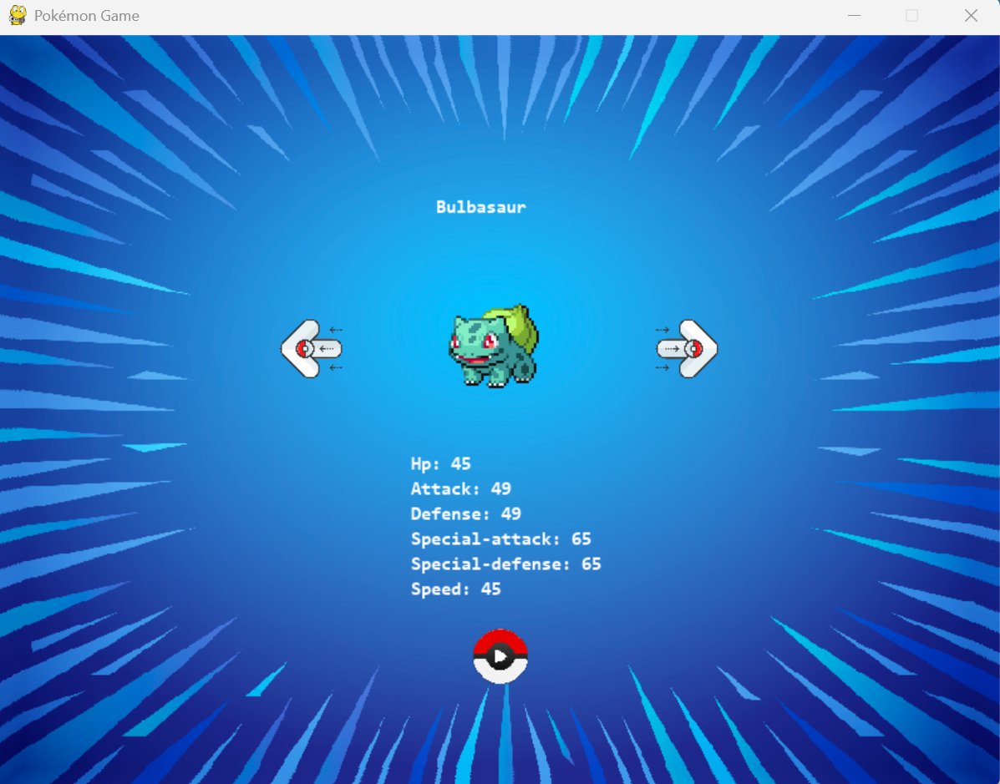
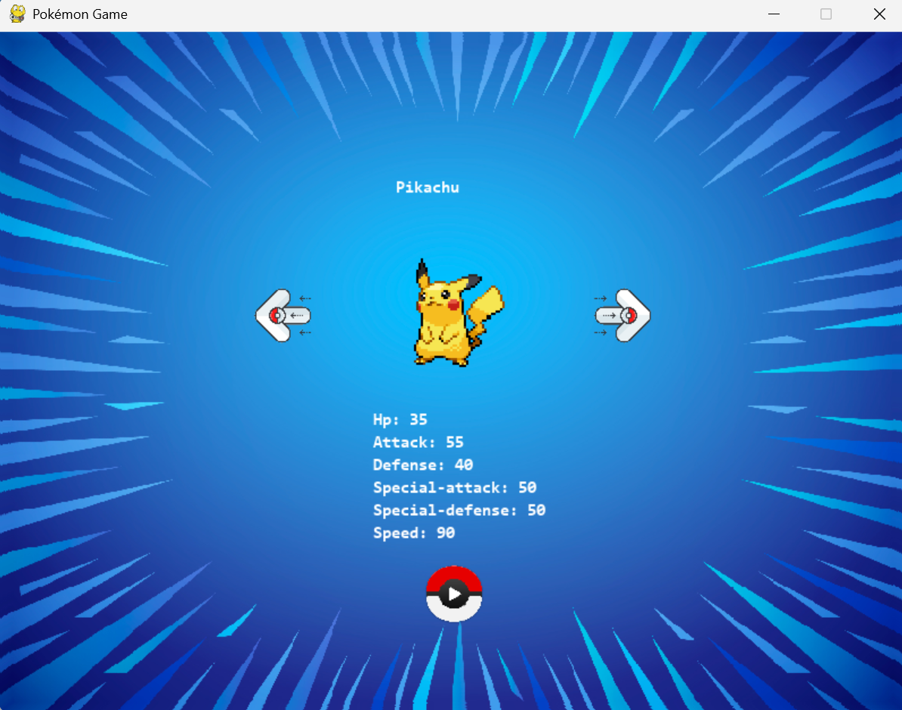
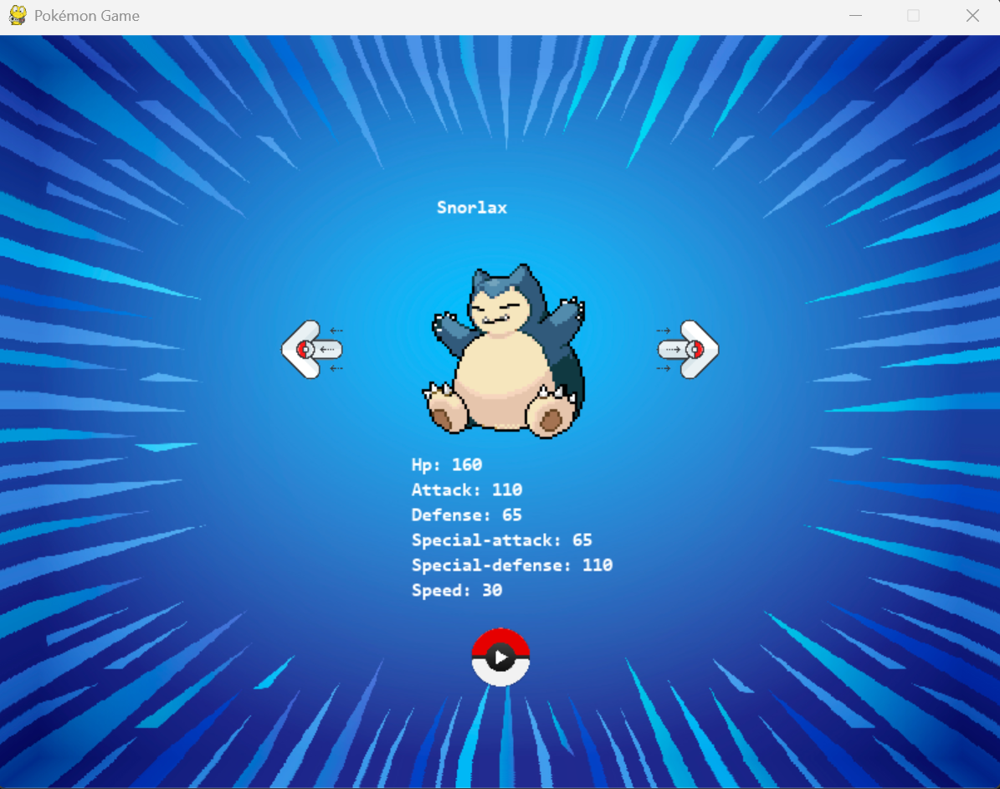
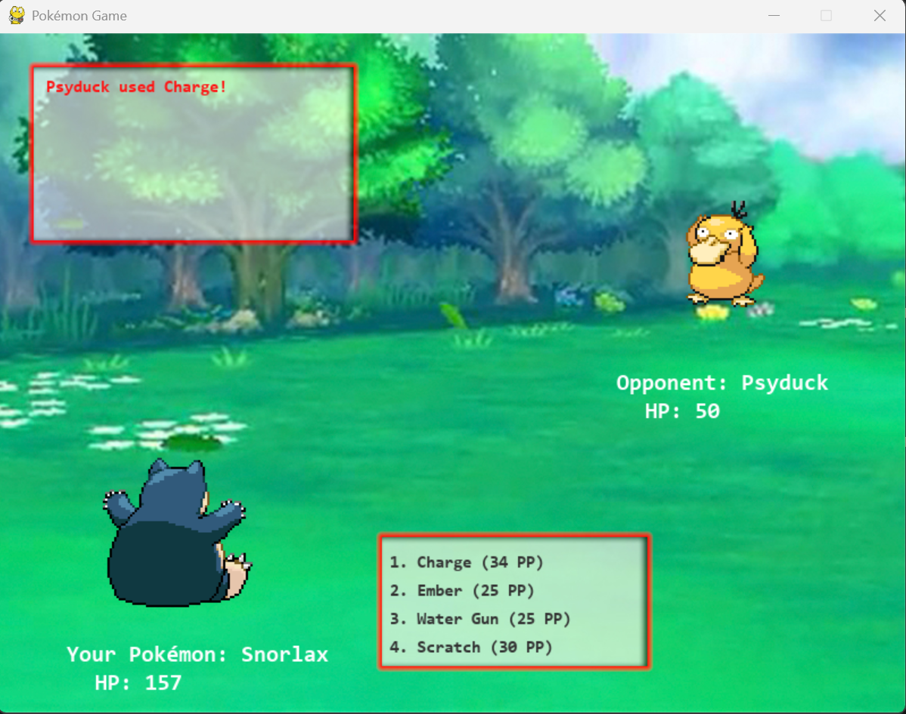
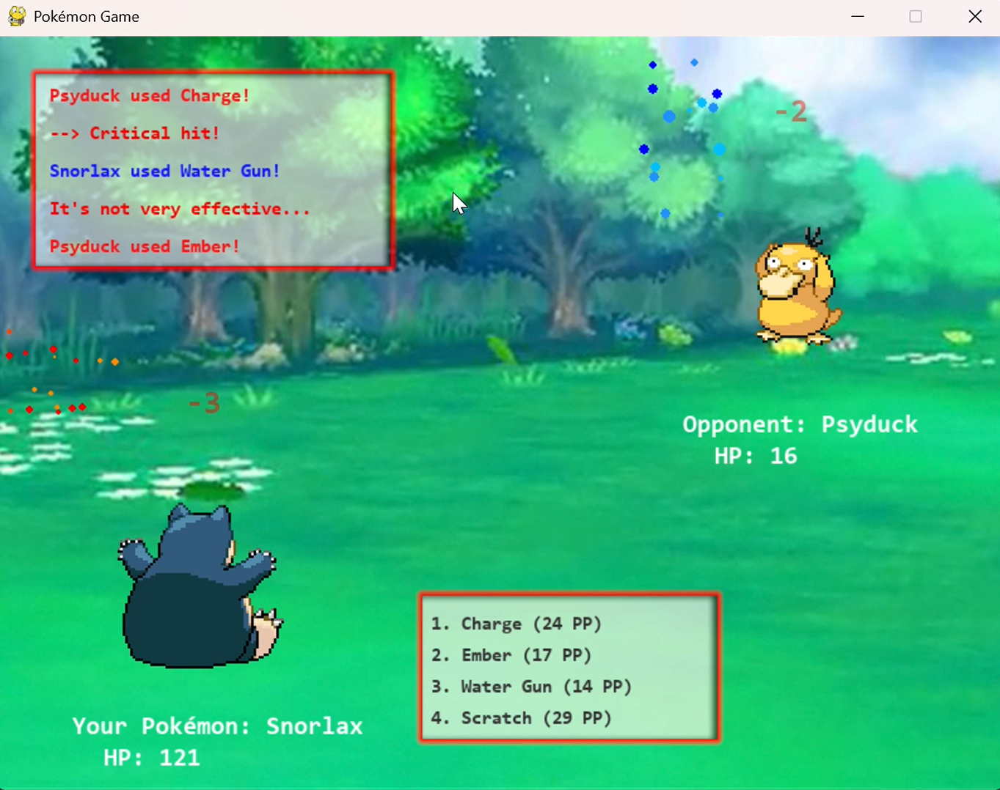
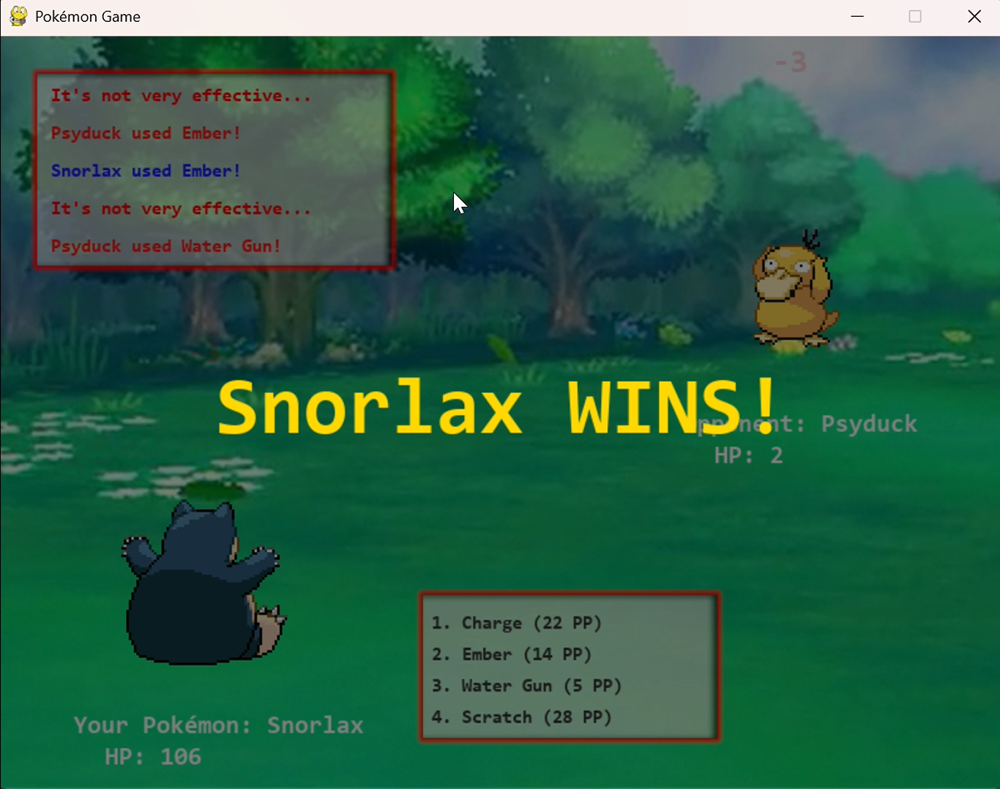

# Pokemon-Game

## 📌 Description

Pokémon Battle est un mini-jeu de combat au tour par tour inspiré des jeux Pokémon. Il permet à deux Pokémon de s'affronter avec des attaques et des statistiques basées sur l'API PokeAPI. Le jeu utilise pygame pour afficher les Pokémon et gérer les interactions.

## 🎯 Fonctionnalités

✔ Sélection automatique de deux Pokémon pour le combat.
✔ Récupération des données des Pokémon depuis PokeAPI.
✔ Système de combat au tour par tour avec gestion des attaques et PV.
✔ Interface graphique simple avec Pygame.
✔ Annonce automatique du gagnant.

# Voici les images de mon projet :

## Page d'accueil (clin d'oeil à mon école La Plateforme)

## Pokedex

## Choix du Pokémon pour le combat

## Combat

## Effets d'attaques et points perdus

## Gagnant

## 🛠️ Technologies utilisées

- Python 3.10+
  
- Pygame (affichage et interactions)
  
- Requests (récupération des données de PokeAPI)
  
- PokeAPI (données des Pokémon)

🔧 Installation et exécution

1️⃣ Prérequis
Assurez-vous d'avoir Python 3.10+ installé sur votre machine.

2️⃣ Cloner le projet

git clone https://github.com/votre-repo/pokemon-battle.git

cd pokemon-battle

3️⃣ Installer les dépendances

pip install -r requirements.txt

4️⃣ Lancer le jeu

python main.py

📌 Exemple d'utilisation

- Le jeu sélectionne deux Pokémon aléatoirement (ex : Pikachu vs Salamèche).

- Chaque Pokémon attaque à tour de rôle.

- Les dégâts sont calculés en fonction des statistiques des Pokémon.
  
- Le combat continue jusqu'à ce qu'un Pokémon atteigne 0 PV.

- Une annonce affiche le gagnant.

  📝 Auteur
  
👤 Clarisse Oyharcabal 
👤 Aicha Chadli
👤 Andres Montes Zuluaga

📌 Projet réalisé dans un cadre éducatif et pour l’apprentissage de Python et Pygame.
